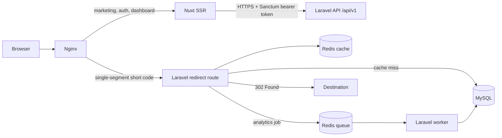
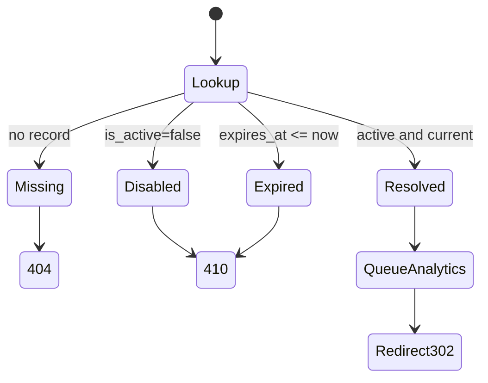
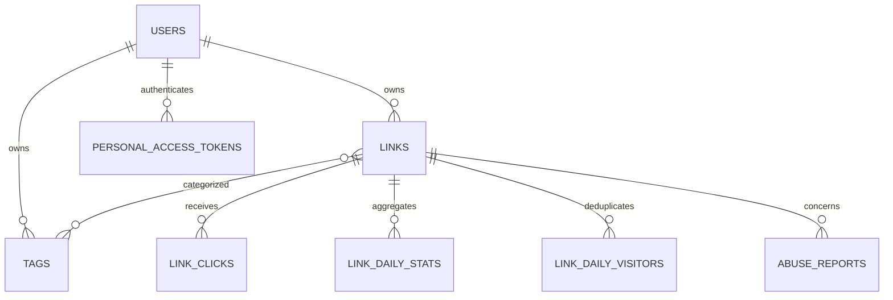
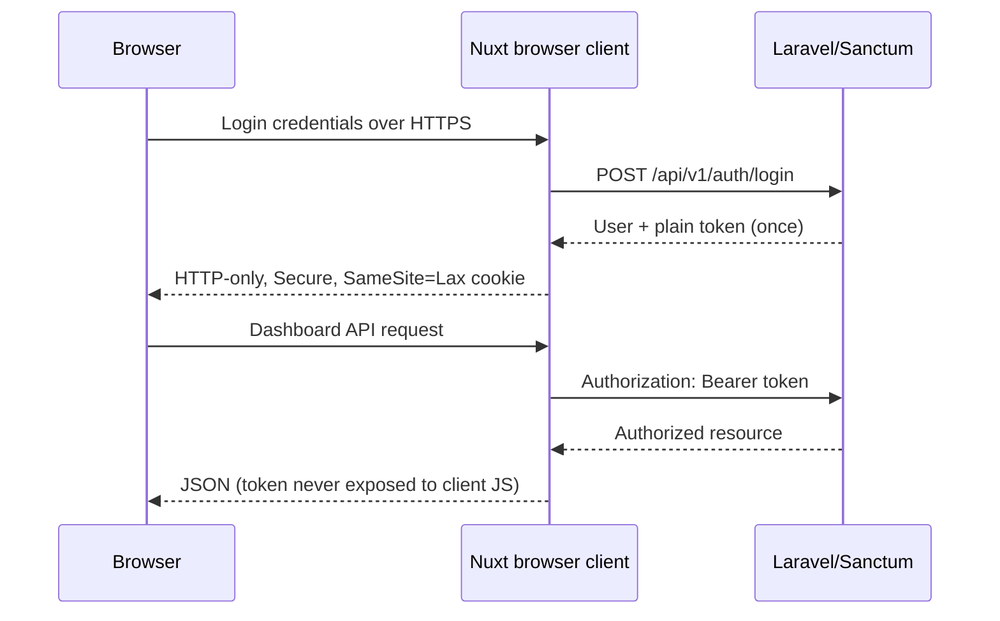

# 247URL architecture

## Boundaries

- **Nuxt 3** owns SSR marketing and legal pages, authentication/dashboard presentation, metadata, robots, sitemap, and one centralized browser API client configured by public runtime config.
- **Laravel 12** is authoritative for identities, authorization, URL validation, code allocation, redirects, link state, analytics, QR codes, abuse controls, API tokens, and scheduled work.
- **MySQL 8** is durable storage. `short_code` and `custom_alias` are unique. Production uses `utf8mb4_bin`, matching the documented case-sensitive alias behavior.
- **Redis** is the redirect metadata cache and queue transport. Link mutations invalidate cache keys immediately. Cache failures are isolated from redirect resolution: Laravel falls back to MySQL, while analytics delivery is best-effort during an outage.

## Request topology

`302 Found` is deliberate: owners can edit destinations, so clients must not permanently cache an old target. Redirect responses also use `Cache-Control: private, no-store`; Redis remains the controlled server-side cache.

## Link creation and concurrency

Generated codes use seven characters from a cryptographically selected base58 alphabet, avoiding ambiguous characters. The service attempts an insert directly, relies on the database unique index, and retries only a detected unique-constraint failure. Custom aliases use the same unique `short_code` index and return a validation error on conflict. A separate configurable reserved-alias list protects application routes.

## Redirect state

The cache stores only link ID, destination, active state, and expiration. A valid cache hit avoids a link query. A miss or malformed payload is resolved from MySQL and repaired in cache. Missing lookups use the separate, short `SHORT_LINK_NEGATIVE_CACHE_TTL`. Create, update (including both sides of an alias change), disable, expiry, moderation, and delete flows invalidate affected keys. If Redis get/put/delete fails, redirect correctness remains database-backed; the failure is logged once per process to avoid a log storm. Queue failure may lose an analytics event, but never blocks a valid 302.

## Data model

`link_clicks` is a bounded-retention event table with a unique event UUID. `link_daily_stats` holds chart-ready aggregates and `link_daily_visitors` provides an atomic daily uniqueness boundary. Job retries are idempotent. Raw IP addresses are never persisted: the redirect creates a keyed, daily HMAC before queue dispatch. Set a dedicated `ANALYTICS_HASH_KEY`; changing it intentionally breaks cross-key correlation. Trusted geo headers are ignored unless `ANALYTICS_TRUST_GEO_HEADERS=true`, and must only be enabled behind an edge that strips client-supplied versions. Region/city storage is separately disabled by default.

## Authentication

Email verification gates dashboard resources. Password reset responses do not reveal whether an account exists. API tokens created in settings have explicit abilities and a 90-day default expiry.

## Scaling notes

- At roughly 100 to 10,000 links, this architecture is intentionally simple: indexed MySQL, Redis lookup cache, and one or more queue workers.
- Around one million links, use cursor pagination for bulk consumers, replicas for reporting, capacity-test Redis/MySQL, and scale stateless redirect nodes and analytics workers by latency and queue depth.
- At tens or hundreds of millions of clicks, partition/export the event table and consider a dedicated analytics store such as ClickHouse or BigQuery. Kafka or another durable event bus becomes appropriate when losing analytics during a Redis outage is no longer acceptable. The redirect source of truth remains MySQL unless a separately engineered edge store is introduced.
- Dashboard timelines and totals read daily aggregates rather than rescanning raw event history. Bounded referrer/device/browser/OS/country dimensions are ownership-filtered against raw events inside the configured retention window.
- A separate short domain requires only DNS, Nginx routing, `SHORT_URL_DOMAIN`, and allowed-origin changes.
- A future billing module can attach plans/usage to users without changing link ownership or redirect resolution.

## Nginx ownership

- Known single-segment Nuxt routes are matched before the constrained short-code regex. Every other `/{3-64 character code}` goes directly to Laravel/PHP-FPM and is never edge-cached.
- `/api/v1/*` on the API hostname goes to Laravel. The main hostname does not expose or proxy Laravel API paths.
- `/dashboard/*`, authentication screens, legal pages, and marketing pages go to Nuxt SSR.
- `/_nuxt/*` is the only long-lived public immutable cache location.
